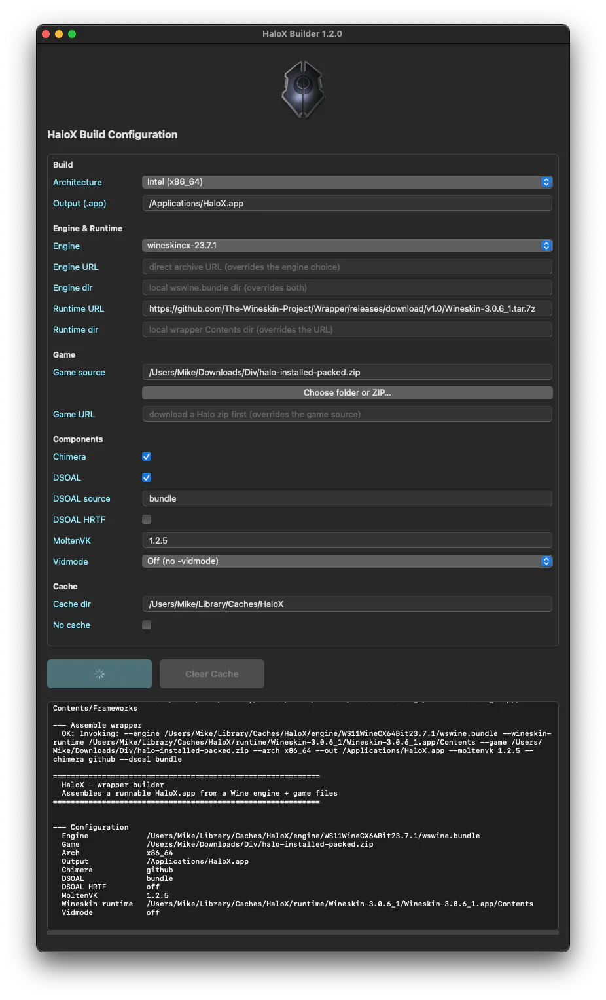

<p align="center">
  
</p>

<h1 align="center">HaloX</h1>

<p align="center">
  <strong>Halo: Combat Evolved, running on modern macOS – Intel and Apple Silicon.</strong>
</p>

---

## About

**HaloX** brings Halo CE (the classic Mac-era Windows build) back to life on current
macOS systems (Sonoma 14 and later) where the original 32-bit executables no longer run.
It packages the game with a modern [Wine](https://www.winehq.org/) engine into a
double-clickable `.app` — and ships with a native GUI builder app, so no terminal
is needed for local builds. Both **Halo: Combat Evolved** and **Halo: Custom
Edition** are supported (same engine, same installation layout).

## Features

- 📦 One-command assembly of a runnable `HaloX.app` (`scripts/build-wrapper.sh`)
- 🖥️ Runs on **Intel** (native) and **Apple Silicon** (via Rosetta 2)
- 🧰 Native GUI builder (`HaloXBuilder.app`, universal, ready to run in the release)
- 🔁 Manual, versioned CI builds via GitHub Actions (artifacts, no release)

## HaloX Builder (GUI)

A native macOS app (`HaloXBuilder.app`, Swift/AppKit) that drives the local
build from a window instead of the terminal — every `scripts/build-local.sh`
option is a field prefilled with the script's defaults (arch, output,
engine/runtime, game source/URL, Chimera, DSOAL, MoltenVK, vidmode, cache).
The build output streams in live and the result shows in a sheet; a button
clears the download cache.

<p align="center">
  
</p>

### Ready to run

The release ZIP (`HaloX-builder-vX.Y.Z.zip`) contains a ready-to-run
`HaloXBuilder.app` — a **universal** binary for **Apple Silicon and Intel**
(arm64 + x86_64), built fresh by CI on every release. Just download, unzip
and double-click.

> **macOS Gatekeeper:** the download is flagged as "from the internet", so
> macOS may start the app from a temporary read-only copy (App Translocation)
> and complain that it is in the wrong location. Clear the flag once, then
> start it again (inside the unzipped `HaloX-X.Y.Z` folder):
>
> ```bash
> xattr -cr HaloXBuilder.app
> ```
>
> This is the same quarantine flag as for `HaloX.app` — see
> [First run after download](#first-run-after-download); here the symptom is
> different (wrong-location dialog instead of "corrupted").

The GUI runs `scripts/build-local.sh` underneath, so all options below apply
unchanged.

### Building the GUI yourself

```bash
./ui/build.sh              # universal (arm64 + x86_64) by default
ARCH=arm64  ./ui/build.sh  # only the arm64 slice
ARCH=x86_64 ./ui/build.sh  # only the Intel slice
```

## Building the wrapper

### Locally (recommended)

**1. Get the project** – clone it, or download `HaloX-builder-vX.Y.Z.zip` from
the [Releases](https://github.com/BUM-MasterMike/HaloX/releases) page and unpack
it. The game files are not in it — you provide your own copy of the installed
Halo CE folder (see [Game data requirements](#game-data-requirements)):

```bash
git clone git@github.com:BUM-MasterMike/HaloX.git
cd HaloX
```

**2. Build.** `scripts/build-local.sh` drives `build-wrapper.sh` with exactly
the same defaults as the CI workflow: WineskinCX 23.7.1 engine (downloaded on
first use and cached in `~/Library/Caches/HaloX`), the Wineskin wrapper runtime,
Chimera **on**, DSOAL `bundle`, MoltenVK 1.2.5. The first run downloads the
engine + runtime (~1–2 GB total); later runs work fully offline.

```bash
# Default: ./game already contains the installed Halo folder
./scripts/build-local.sh

# Game files from a zip in the project folder
./scripts/build-local.sh --game ./Halo.zip

# Game files downloaded from a URL first, then built
./scripts/build-local.sh --game-url https://example.com/Halo-full.zip

# A trailing positional URL is a shortcut for --game-url
./scripts/build-local.sh https://example.com/Halo-full.zip

# Scaled "Looks like" display (e.g. MacBook Air)? Bundle a -vidmode value so
# Halo starts at the current desktop resolution (no -vidmode = default build).
# Without a value an interactive preset picker opens (all aliases from
# scripts/vidmode-presets.sh plus free W,H,R input):
./scripts/build-local.sh --vidmode

# Or pick the preset directly: an alias (macbook-air-13, ...) or a literal
./scripts/build-local.sh --vidmode macbook-air-13
./scripts/build-local.sh --vidmode 1280,800,60

# Pin a different engine (other WineskinCX versions) or a direct archive URL
./scripts/build-local.sh --engine wineskincx-23.6.0
./scripts/build-local.sh --engine-url https://github.com/vitor251093/porting-kit-engines/releases/download/wineskin/WS11WineCX64Bit23.7.1.tar.7z
```

What a local run looks like in the terminal (incl. the first-run engine/runtime
download) — [example build output](#appendix-example-build-output).

### Directly

```bash
./scripts/build-wrapper.sh \
  --engine /path/to/wswine.bundle \
  --wineskin-runtime /path/to/WineskinWrapper.app/Contents \
  --game ./Halo.zip \
  --arch x86_64 \
  --chimera github \
  --dsoal bundle \
  --out HaloX.app
```

| Argument | Description |
|---|---|
| `--engine` | Path to a Wine engine directory. For the recommended WineskinCX engine this is the `wswine.bundle` dir inside the `.tar.7z` (must contain `bin/`, `lib/`, `share/`) |
| `--wineskin-runtime` | Path to a Wineskin wrapper's `Contents` dir (contains `Frameworks/`). WineskinCX engines load their shared libraries (MoltenVK, SDL2, ICU, …) from `Contents/Frameworks` at runtime; without it Wine fails with "Library not loaded". `GStreamer.framework` is excluded automatically (crash source) |
| `--game`    | Full installed Halo folder **or** a zip of it – see [Game data requirements](#game-data-requirements) below |
| `--arch`    | `x86_64` or `arm64` (metadata; Wine still runs x86 via Rosetta on arm64) |
| `--chimera` | `github` to download the latest Chimera release, or a local zip/dir |
| `--dsoal`   | `bundle` (default) = checked-in tested build (DSOAL `d9fed51a` + OpenAL Soft 1.23.1); `github` = latest daily build (not recommended); or a local zip/dir |
| `--dsoal-hrtf` | Force DSOAL binaural HRTF output for headphones |
| `--moltenvk` | MoltenVK version bundled for the optional vulkan override (default `1.2.5`; use `none` to keep the engine's) |
| `--vidmode`  | Bundle a `-vidmode` value (`W,H,R` or a preset alias) so the game starts at the current desktop resolution and wined3d skips the mode change. Needed on scaled "Looks like" displays (e.g. MacBook Air) that refuse Halo's first-run 640×480 mode change. Default: off. Aliases live in `scripts/vidmode-presets.sh` |
| `--out`     | Output `.app` bundle |

## Supported game editions

HaloX works with the installed Windows Halo folder of both **Halo: Combat
Evolved** and **Halo: Custom Edition**. The two editions are based on the same
engine and use the same installation layout (`halo.exe`/`haloce.exe`, maps,
engine DLLs), so the HaloX Builder treats them identically — just point it at
the installed folder of either edition. The builder detects the game
executable automatically (`halo.exe` or `haloce.exe`) and launches the right
one.

> **Chimera requires the official 1.00.10.xxxx patch.** Chimera only works with
> the official patch **1.00.10.xxxx**, for Combat Evolved and Custom Edition. The
> patch can be found online and is freely available for download. Make sure the
> Halo installation you use for the HaloX Builder **already includes** this
> official patch — otherwise Chimera will not work.
>
> There are indications that the game should **not** be started right
> after installing Halo, but only after the official patch has been
> applied. Usually you patch your Halo installation **on Windows** before
> you need it for HaloX. Patching afterwards from inside the Wine wrapper
> is theoretically possible, but is more involved and requires
> some wine expertise.

## Game data requirements

`halo.exe` and the game assets are **not redistributable**, so the build never
fetches them – you provide them via `--game` (or the CI `game_zip_url` input).
The build itself only validates that the game executable (`halo.exe` or
`haloce.exe`) is present; for the game to actually run it also needs its map
data. A **full installed Halo folder** (Combat Evolved or Custom Edition)
contains at minimum:

| Required | Notes |
|---|---|
| `halo.exe` or `haloce.exe` | The game executable — `halo.exe` (Combat Evolved) or `haloce.exe` (Custom Edition). The build fails if neither is present. |
| `bitmaps.map`, `sounds.map` | Shared map data. In the reference GOG-style layout these live inside a `MAPS/` subfolder; a classic layout keeps them next to `halo.exe`. Both work – the engine resolves the folder case-insensitively. |
| level maps | At least one playable level map (e.g. `bloodgulch.map`). |
| the rest of the installed folder | Engine DLLs (`binkw32.dll`, `msvcr71.dll`, …), videos, readme. Simplest: include the **whole** installed game folder. |

The installation must already include the official patch **1.00.10.xxxx** — Chimera
does not work without it (see [Supported game editions](#supported-game-editions)).

**Zip layout:** `build-wrapper.sh` accepts both layouts. It extracts the zip and
looks for `halo.exe`/`haloce.exe` (plus `MAPS/` / the map files) on the top level; if the zip
wraps the game in a single folder (e.g. `Halo/halo.exe`), that wrapping folder
is stepped into automatically.

Chimera and DSOAL do **not** need to be part of your game data – the build adds
them automatically (`--chimera` / `--dsoal`). `config.txt` is left untouched.

## First run after download

The app is ad-hoc signed but **not notarized**, so macOS Gatekeeper blocks it the
first time after downloading ("HaloX.app is corrupted and can't be opened"). Unpack
the ZIP and run this **once** in Terminal:

> **Note:** This only applies to **downloaded builds (CI artifacts)** — a
> locally built `HaloX.app` has no quarantine flag and runs immediately.
> Only the workflow owner ever loads a CI artifact, so this is mostly irrelevant
> for end users.

```bash
chmod -R u+w /Applications/HaloX.app
xattr -cr /Applications/HaloX.app
```

- `chmod -R u+w` makes the bundle writable (ZIPs often extract read-only).
- `xattr -cr` clears the quarantine flag set by the download.

Then open it normally (or right-click → *Open*). Adjust the path if you keep the
app somewhere else (e.g. `~/Downloads/HaloX.app`).

**Still "corrupted"?** Re-apply the ad-hoc signature after clearing quarantine:

```bash
codesign --force --deep --sign - /Applications/HaloX.app
```

**Permission denied while clearing quarantine?** Make the app writable first (as
above) or use `sudo xattr -cr /Applications/HaloX.app`.

## Troubleshooting

**Game crashes on startup with `Placement heap type is not supported`**

That was the symptom of the old default Vulkan renderer on GPUs without Metal
placement heaps (e.g. NVIDIA GTX 6xx/7xx). The current build always uses the
OpenGL path, which avoids it. If you still see it, you (or a previous build)
forced the Vulkan renderer; run once without the override:

```bash
HALOX_D3D_RENDERER=gl /Applications/HaloX.app/Contents/MacOS/HaloX
```

**Ping to online servers fluctuates, or the connection hiccups for a moment every ~0.5 s?**

That is usually macOS, not HaloX. macOS runs a set of "Continuity" features
that periodically use the Wi-Fi radio in the background:

- **AWDL** (*Apple Wireless Direct Link*, the `awdl0` interface) is the
  peer-to-peer Wi-Fi channel behind **AirDrop**, **AirPlay**, **Sidecar**,
  **Handoff/Continuity** and **Universal Control**. While it is active, macOS
  briefly pulls the Wi-Fi radio off your normal channel to look for nearby
  Apple devices – typically once per second for ~50–100 ms. That is exactly
  what shows up as a short ping spike or stall.
- **Universal Control**, **Handoff** and **Universal Clipboard** keep AWDL and
  Bluetooth awake while they are enabled.
- Nearby Apple devices (iPhone, iPad, another Mac) can trigger AWDL on your Mac
  even if you are not using those features yourself.

It happens below the game, so it affects any low-latency app (online gaming,
cloud gaming, video calls); the same Mac under Boot Camp is unaffected.

**What you can do (optional).** Before playing, turn off the Continuity
features you do not need:

- System Settings → General → **AirDrop & Continuity**: turn off **AirDrop**,
  **Handoff**, **AirPlay Receiver** and **Continuity Camera**.
- System Settings → Displays → **Advanced**: turn off **Universal Control**
  ("Allow your pointer and keyboard to move between any nearby Mac or iPad").
- Keep Bluetooth on for your keyboard/mouse – it is only the Continuity
  features that need to go.

Advanced (needs the admin password): take the AWDL interface down for the
current session. This disables AirDrop/AirPlay/Handoff/Universal Control until
you re-enable it (it also comes back after sleep/reboot):

```bash
sudo ifconfig awdl0 down   # off
sudo ifconfig awdl0 up     # back on
```

Sources:

- [Meter – macOS/AWDL PSA](https://www.meter.com/mac-osx-awdl-psa)
- [The Register – AirDrop causes Wi-Fi jitter](https://www.theregister.com/on-prem/2025/10/23/apples-airdrop-makes-weird-latency-spikes-for-wi-fi-wonks/1422197)
- [Apple – Universal Control](https://support.apple.com/en-ca/102459)
- [Apple – Handoff](https://support.apple.com/guide/mac-help/hand-off-tasks-between-devices-mchl732d3c0a/mac)
- [AWDLControl (GitHub) – disables AWDL while gaming](https://github.com/james-howard/AWDLControl)

## CI

<details>
<summary>GitHub Actions workflow</summary>

The workflow `.github/workflows/build-wrapper.yml` is **manually** triggered
(Actions → *Build HaloX Wrapper* → *Run workflow*) and produces:

- `HaloX-Intel-vX.Y.Z.zip` (macos-15-intel) – when `platform` is `intel` or `both`
- `HaloX-Silicon-vX.Y.Z.zip` (macos-latest / Apple Silicon) – when `platform` is `silicon` or `both`

No GitHub Release is created – the ZIPs appear in the run's **Artifacts**.
The version is taken from the topmost `CHANGELOG.md` section and shows up in the
artifact names.

Manual workflow inputs:

- `game_zip_url` – URL of a zip with the full installed Halo folder (preferred for CI); same layout requirements as `--game` (see [Game data requirements](#game-data-requirements))
- `with_chimera` (`true`/`false`, default `true`) – include Chimera in the build?
- `with_dsoal` (`true`/`false`, default `true`) – include DSOAL (3D audio) in the build?
- `dsoal` (`bundle`/`github`/URL, default `bundle`) – DSOAL source: `bundle` = the checked-in tested build (recommended), `github` = latest daily build, or a URL to a DSOAL archive
- `dsoal_hrtf` (`true`/`false`, default `false`) – force binaural HRTF output for headphones?
- `engine` (`wineskincx-23.7.1` default) – Wine engine to use. **WineskinCX 23.7.1 (WS11) is the verified engine for Halo**; Gcenx Wine 11 does not work (data-cache errors). Other WS11 WineskinCX versions can be selected for testing.
- `engine_url` – optional direct URL to a WineskinCX engine archive (same `wswine.bundle` layout); overrides the `engine` choice
- `platform` (`both` default) – which platform(s) to build: `intel`, `silicon`, or `both`. Pick a single platform when the `-vidmode` settings differ per machine (e.g. Intel without vidmode, Silicon with a preset)
- `moltenvk` (`1.2.5` default) – MoltenVK version bundled for the optional vulkan override (`none` keeps the engine's)
- `vidmode` (`none` default) – bundle a `-vidmode` value so the game starts at the current desktop resolution (wined3d skips the mode change); needed on scaled "Looks like" displays (e.g. MacBook Air) where Halo's first-run 640×480 mode change is refused. `none` = default build (Halo/Chimera handle the resolution); pick a preset alias (`macbook-air-13`, …) or `custom` + `vidmode_custom`
- `vidmode_custom` – free-form `W,H,R` value (e.g. `1280,800,60`) used when `vidmode` is `custom`; leave empty for the default build

The CI also downloads the matching Wineskin **wrapper runtime** (the
`Contents/Frameworks` shared libraries the engine needs at runtime), so a CI
build reproduces the verified local setup.

> **Renderer note:** HaloX always renders Direct3D through Wine's OpenGL path
> (`gl`), exactly like the known-good reference wrapper. This works on Intel and
> Apple Silicon and needs no Vulkan/MoltenVK. If you want to experiment with the
> Vulkan renderer for a single run, use `HALOX_D3D_RENDERER=vulkan` before
> launching the app.

</details>

## Development

- Launcher script: `wrapper/HaloX-Launcher.sh`
- Build script: `scripts/build-wrapper.sh`
- Workflows: `.github/workflows/build-wrapper.yml` (app build) and `.github/workflows/build.yml` (project release, incl. the freshly built `HaloXBuilder.app`)

## License

Copyright (c) 2026 BUM MasterMike – released under the [MIT License](LICENSE).

## Appendix: Example build output

Terminal output of a local build (`./scripts/build-local.sh --game …`) with the
WineskinCX engine and the Wineskin runtime already cached (the first run
downloads them, later runs reuse `~/Library/Caches/HaloX`), as seen in macOS
Terminal:


