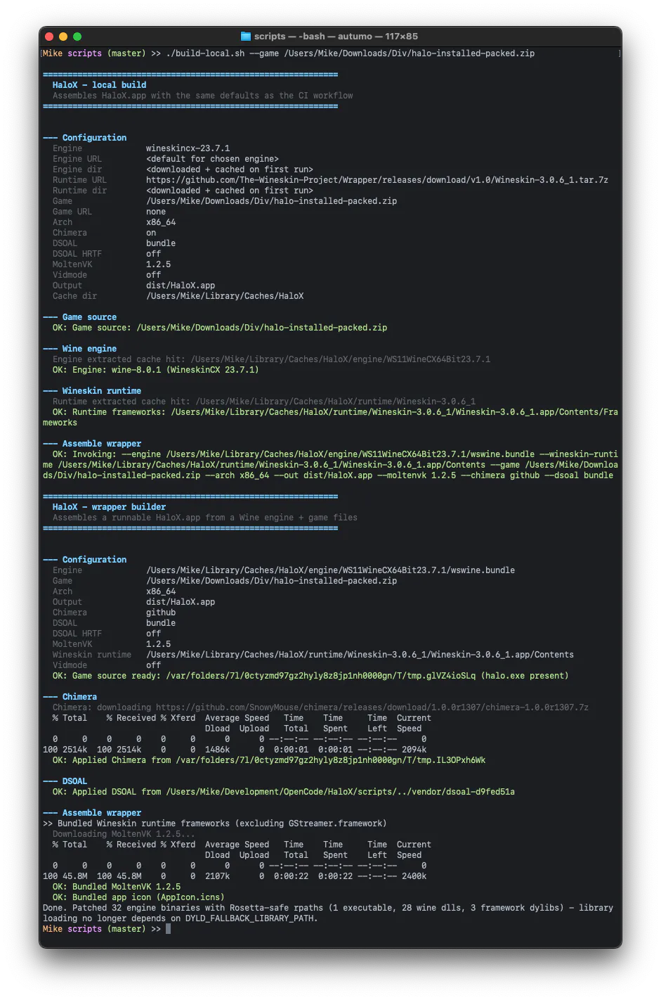

<p align="center">
  
</p>

<h1 align="center">HaloX</h1>

<p align="center">
  <strong>Halo: Combat Evolved, running on modern macOS – Intel and Apple Silicon.</strong>
</p>

---

## About

**HaloX** brings Halo CE (the classic Mac-era Windows build) back to life on current
macOS systems (Sonoma 14 and later) where the original 32-bit executables no longer run.
It packages the game with a modern [Wine](https://www.winehq.org/) engine into a
double-clickable `.app`.

## Features

- 📦 One-command assembly of a runnable `HaloX.app` (`scripts/build-wrapper.sh`)
- 🖥️ Runs on **Intel** (native) and **Apple Silicon** (via Rosetta 2)
- 🔁 Manual, versioned CI builds via GitHub Actions (artifacts, no release)

## Building the wrapper

### Locally (recommended)

**1. Get the repo** (the game files are not in it — you provide your own copy
of the installed Halo CE folder, see [Game data requirements](#game-data-requirements)):

```bash
git clone git@github.com:BUM-MasterMike/HaloX.git
cd HaloX
```

**2. Build.** `scripts/build-local.sh` drives `build-wrapper.sh` with exactly
the same defaults as the CI workflow: WineskinCX 23.7.1 engine (downloaded on
first use and cached in `~/Library/Caches/HaloX`), the Wineskin wrapper runtime,
Chimera **on**, DSOAL `bundle`, MoltenVK 1.2.5. The first run downloads the
engine + runtime (~1–2 GB total); later runs work fully offline.

```bash
# Default: ./game already contains the installed Halo folder
./scripts/build-local.sh

# Game files from a zip in the project folder
./scripts/build-local.sh --game ./Halo.zip

# Game files downloaded from a URL first, then built
./scripts/build-local.sh --game-url https://example.com/Halo-full.zip

# A trailing positional URL is a shortcut for --game-url
./scripts/build-local.sh https://example.com/Halo-full.zip

# Scaled "Looks like" display (e.g. MacBook Air)? Bundle a -vidmode value so
# Halo starts at the current desktop resolution (no -vidmode = default build).
# Without a value an interactive preset picker opens (all aliases from
# scripts/vidmode-presets.sh plus free W,H,R input):
./scripts/build-local.sh --vidmode

# Or pick the preset directly: an alias (macbook-air-13, ...) or a literal
./scripts/build-local.sh --vidmode macbook-air-13
./scripts/build-local.sh --vidmode 1280,800,60

# Pin a different engine (other WineskinCX versions) or a direct archive URL
./scripts/build-local.sh --engine wineskincx-23.6.0
./scripts/build-local.sh --engine-url https://github.com/vitor251093/porting-kit-engines/releases/download/wineskin/WS11WineCX64Bit23.7.1.tar.7z
```

What a local run looks like in the terminal (incl. the first-run engine/runtime
download) — [example build output](#appendix-example-build-output).

### Directly

```bash
./scripts/build-wrapper.sh \
  --engine /path/to/wswine.bundle \
  --wineskin-runtime /path/to/WineskinWrapper.app/Contents \
  --game ./Halo.zip \
  --arch x86_64 \
  --chimera github \
  --dsoal bundle \
  --out HaloX.app
```

| Argument | Description |
|---|---|
| `--engine` | Path to a Wine engine directory. For the recommended WineskinCX engine this is the `wswine.bundle` dir inside the `.tar.7z` (must contain `bin/`, `lib/`, `share/`) |
| `--wineskin-runtime` | Path to a Wineskin wrapper's `Contents` dir (contains `Frameworks/`). WineskinCX engines load their shared libraries (MoltenVK, SDL2, ICU, …) from `Contents/Frameworks` at runtime; without it Wine fails with "Library not loaded". `GStreamer.framework` is excluded automatically (crash source) |
| `--game`    | Full installed Halo folder **or** a zip of it – see [Game data requirements](#game-data-requirements) below |
| `--arch`    | `x86_64` or `arm64` (metadata; Wine still runs x86 via Rosetta on arm64) |
| `--chimera` | `github` to download the latest Chimera release, or a local zip/dir |
| `--dsoal`   | `bundle` (default) = checked-in tested build (DSOAL `d9fed51a` + OpenAL Soft 1.23.1); `github` = latest daily build (not recommended); or a local zip/dir |
| `--dsoal-hrtf` | Force DSOAL binaural HRTF output for headphones |
| `--moltenvk` | MoltenVK version bundled for the optional vulkan override (default `1.2.5`; use `none` to keep the engine's) |
| `--vidmode`  | Bundle a `-vidmode` value (`W,H,R` or a preset alias) so the game starts at the current desktop resolution and wined3d skips the mode change. Needed on scaled "Looks like" displays (e.g. MacBook Air) that refuse Halo's first-run 640×480 mode change. Default: off. Aliases live in `scripts/vidmode-presets.sh` |
| `--out`     | Output `.app` bundle |

## Game data requirements

`halo.exe` and the game assets are **not redistributable**, so the build never
fetches them – you provide them via `--game` (or the CI `game_zip_url` input).
The build itself only validates that `halo.exe` is present; for the game to
actually run it also needs its map data. A **full installed Halo CE folder**
contains at minimum:

| Required | Notes |
|---|---|
| `halo.exe` | The build fails if this is missing. |
| `bitmaps.map`, `sounds.map` | Shared map data. In the reference GOG-style layout these live inside a `MAPS/` subfolder; a classic layout keeps them next to `halo.exe`. Both work – the engine resolves the folder case-insensitively. |
| level maps | At least one playable level map (e.g. `bloodgulch.map`). |
| the rest of the installed folder | Engine DLLs (`binkw32.dll`, `msvcr71.dll`, …), videos, readme. Simplest: include the **whole** installed game folder. |

**Zip layout matters:** `build-wrapper.sh` extracts a zip and then looks for
`halo.exe` **directly in the zip root** – there must be **no wrapper folder**.
A zip that contains `Halo/halo.exe` fails; it must contain `halo.exe` at the top
level (and `MAPS/` / the map files at the same level).

Chimera and DSOAL do **not** need to be part of your game data – the build adds
them automatically (`--chimera` / `--dsoal`). `config.txt` is left untouched.

## CI

The workflow `.github/workflows/build-wrapper.yml` is **manually** triggered
(Actions → *Build HaloX Wrapper* → *Run workflow*) and produces:

- `HaloX-Intel-vX.Y.Z.zip` (macos-15-intel) – when `platform` is `intel` or `both`
- `HaloX-Silicon-vX.Y.Z.zip` (macos-latest / Apple Silicon) – when `platform` is `silicon` or `both`

No GitHub Release is created – the ZIPs appear in the run's **Artifacts**.
The version is fixed in the workflow (`env.VERSION`) and shows up in the artifact names.

Manual workflow inputs:

- `game_zip_url` – URL of a zip with the full installed Halo folder (preferred for CI); same layout requirements as `--game` (see [Game data requirements](#game-data-requirements))
- `with_chimera` (`true`/`false`, default `true`) – include Chimera in the build?
- `with_dsoal` (`true`/`false`, default `true`) – include DSOAL (3D audio) in the build?
- `dsoal` (`bundle`/`github`/URL, default `bundle`) – DSOAL source: `bundle` = the checked-in tested build (recommended), `github` = latest daily build, or a URL to a DSOAL archive
- `dsoal_hrtf` (`true`/`false`, default `false`) – force binaural HRTF output for headphones?
- `engine` (`wineskincx-23.7.1` default) – Wine engine to use. **WineskinCX 23.7.1 (WS11) is the verified engine for Halo**; Gcenx Wine 11 does not work (data-cache errors). Other WS11 WineskinCX versions can be selected for testing.
- `engine_url` – optional direct URL to a WineskinCX engine archive (same `wswine.bundle` layout); overrides the `engine` choice
- `platform` (`both` default) – which platform(s) to build: `intel`, `silicon`, or `both`. Pick a single platform when the `-vidmode` settings differ per machine (e.g. Intel without vidmode, Silicon with a preset)
- `moltenvk` (`1.2.5` default) – MoltenVK version bundled for the optional vulkan override (`none` keeps the engine's)
- `vidmode` (`none` default) – bundle a `-vidmode` value so the game starts at the current desktop resolution (wined3d skips the mode change); needed on scaled "Looks like" displays (e.g. MacBook Air) where Halo's first-run 640×480 mode change is refused. `none` = default build (Halo/Chimera handle the resolution); pick a preset alias (`macbook-air-13`, …) or `custom` + `vidmode_custom`
- `vidmode_custom` – free-form `W,H,R` value (e.g. `1280,800,60`) used when `vidmode` is `custom`; leave empty for the default build

The CI also downloads the matching Wineskin **wrapper runtime** (the
`Contents/Frameworks` shared libraries the engine needs at runtime), so a CI
build reproduces the verified local setup.

> **Renderer note:** HaloX always renders Direct3D through Wine's OpenGL path
> (`gl`), exactly like the known-good reference wrapper. This works on Intel and
> Apple Silicon and needs no Vulkan/MoltenVK. If you want to experiment with the
> Vulkan renderer for a single run, use `HALOX_D3D_RENDERER=vulkan` before
> launching the app.

## First run after download

The app is ad-hoc signed but **not notarized**, so macOS Gatekeeper blocks it the
first time after downloading ("HaloX.app is corrupted and can't be opened"). Unpack
the ZIP and run this **once** in Terminal:

> **Note:** This only applies to **downloaded builds (CI artifacts)** — a
> locally built `HaloX.app` has no quarantine flag and runs immediately.
> Only the workflow owner ever loads a CI artifact, so this is mostly irrelevant
> for end users.

```bash
chmod -R u+w /Applications/HaloX.app
xattr -cr /Applications/HaloX.app
```

- `chmod -R u+w` makes the bundle writable (ZIPs often extract read-only).
- `xattr -cr` clears the quarantine flag set by the download.

Then open it normally (or right-click → *Open*). Adjust the path if you keep the
app somewhere else (e.g. `~/Downloads/HaloX.app`).

**Still "corrupted"?** Re-apply the ad-hoc signature after clearing quarantine:

```bash
codesign --force --deep --sign - /Applications/HaloX.app
```

**Permission denied while clearing quarantine?** Make the app writable first (as
above) or use `sudo xattr -cr /Applications/HaloX.app`.

## Troubleshooting

**Game crashes on startup with `Placement heap type is not supported`**

That was the symptom of the old default Vulkan renderer on GPUs without Metal
placement heaps (e.g. NVIDIA GTX 6xx/7xx). The current build always uses the
OpenGL path, which avoids it. If you still see it, you (or a previous build)
forced the Vulkan renderer; run once without the override:

```bash
HALOX_D3D_RENDERER=gl /Applications/HaloX.app/Contents/MacOS/HaloX
```

## Development

- Launcher script: `wrapper/HaloX-Launcher.sh`
- Build script: `scripts/build-wrapper.sh`
- Workflow: `.github/workflows/build-wrapper.yml`

## License

Copyright (c) 2026 BUM MasterMike – released under the [MIT License](LICENSE).

Most source code is MIT unless noted otherwise. Artwork and audio are not under a license.

## Appendix: Example build output

Terminal output of a local build (`./scripts/build-local.sh --game …`) including
the first-run download of the WineskinCX engine and the Wineskin runtime, as seen
in macOS Terminal:


